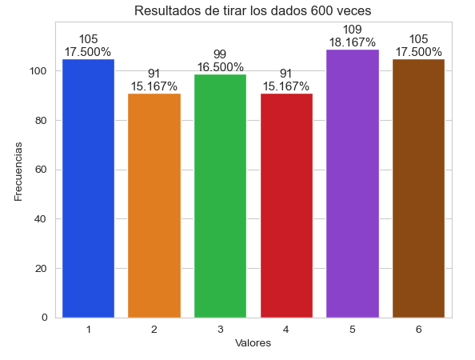

# Curso de Python para data Scientist
## Clase 1: Sentencia if
```py
nac=1999
if 2021-nac>=25:
    print("posible cliente")
```
## Clase 2: Listas 
Una lista se declara en **CORCHETES** 

`A=[1,2,3,4,5] `

`B=["maria",'Rodriguez']`

Hacer una llamado a un elemento de la lista
`A[4]`

Ver Longitud del la lista
`len(A)`

Añadir elementso en una lista vacia DINAMICA
```py
mi_secuencia=[]
for número in range(-2,3):
    mi_secuencia += [número]
    
print(mi_secuencia)

#[-2, -1, 0, 1, 2]
```
Partir letra por letra a un palabra
```py
letras =[]
letras += 'Comida'

print(letras)

#['C', 'o', 'm', 'i', 'd', 'a']
```
Visualizar indices y valores:
```py
lista=['hola',2,5,'jego',10,55,8,4]
for i in range(len(lista)):
    print(f'{i}:{lista[i]}')
```

## Clase 2: Tuplas
Un tupla es un tipo de lista de donde se guardan valores pero **ya no se puede**:
* cambiara valores de los elementos a diferencia de listas.
* Iterar

Se declaran en **paréntesis**()
ejemplo:
```py
# Ejercicio 1: Crear una tupla
tupla=()
print(len(tupla))

# Ejercicio 2: Crear una tupla con elementos
tupla2=('hola','como','estas')
print(len(tupla2))
```
Para llamar un elemento de un tupla, se pone el nombre de la tupla y entre corchetes la posición
```py
# Ejercicio 3: Llamar elementos de una tupla
print(tupla2[1],'se llama para decirle ',tupla2[0])
```

### Listas dentro de una Tupla
```py
# Ejercicio 4: Listas dentro de una tupla y asignar variables a sus elementos
datos_Paciente=('Paolo',[27,54])
nombre , edad_peso = datos_Paciente;

print(nombre)
print(edad_peso)

estatura, peso , temperatura =(1.5,64,20)
print(f'{estatura}-{peso}-{temperatura}')

#Paolo
#[27, 54]
#1.5-64-20
```

### Tuplas dentro de una listas
Enumerar elementos (indices)
```py
nombres=('Paolo','Marlon','Mario')
lista_nombres=list(enumerate(nombres))
tupla_nombres=tuple(enumerate(nombres))

print(lista_nombres)
print(tupla_nombres)

for indice,valor in enumerate(nombres):
    print(f'{indice}:{valor}')


#[(0, 'Paolo'), (1, 'Marlon'), (2, 'Mario')]
#((0, 'Paolo'), (1, 'Marlon'), (2, 'Mario'))

# 0:Paolo
# 1:Marlon
# 2:Mario
```
## Clase 3 : Separando secuencias (Listas)

Extraer elementos de una lista
```py
potencias2=[2,4,8,16,32,64,128,264]
print(potencias2[3:5])
print(potencias2[:5])
print(potencias2[3:])
print(potencias2[:])
print(potencias2[::2])
print(potencias2[::-3])
```


Cambiar elementos de una lista
```py
potencias2[0:3]=['dos','cuatro','ocho']
print(potencias2[:])
print(id(potencias2))
```

Poner valores vacios en la lista
```py
potencias2[0:2]=[]
print(potencias2)
```

Obtener un IDENTIFICADOR de la lista
```py
id(potencias2)
print(id(potencias2))
```

Borrar elementos de una lista (Del)


```py
multiplos10= list(range(0,100,10))
print(multiplos10)

#borrar elelmentos desde la posición 3-6
del multiplos10[3:6]
print(multiplos10)

#borrar con un tamaño de paso
multiplos10_2 = list(range(0,100,10))
del multiplos10_2[::2]
print(multiplos10_2)

#borrar la lista completa
del multiplos10_2[:]
print(multiplos10_2)
```

## Clase 4: Ordenando Listas y tuplas
Tanto listas y tuplas se ordenan con los comandos:
* `sort()` -> ordena ascendente una lista o tupla
* `sort(reverse = True)` -> ordena descendente una lista o tupla
* `sorted(nombre_de_lista)` -> ordena ascendente una lista o tupla y los asigna a otra lista o tupla.


```py
#Ejercicio 1:Ordenar listas 
edad=[20,24,15,26,15,18,89]
edad.sort()
print(edad)

#Ejercicio 2:Ordenar listas descendente
edad.sort(reverse=True)
print(edad)

#Ejercicio 3: Ordenar y pasarlo a otra lista
edad2=[20,24,15,26,15,18,89]
edad_ascendente=sorted(edad2)
print(edad_ascendente)


# [15, 15, 18, 20, 24, 26, 89]
# [89, 26, 24, 20, 18, 15, 15]
# [15, 15, 18, 20, 24, 26, 89]
```

### Búsqueda de datos en una lista
```py
#Ejercicio 6: verificar si un elemento está en lista
print(78 in edad3)
```
### Otras funciones para extraer elementos de un lista o tupla
* `lista.insert(index,'elemento')`
* `lista.append('elemento')`
* `lista.extend(listaParaAgregar)`
* `lista.remove()`

```py
#Ejercicio 7: Insertar elementos en una lista
vegetales = ['espinaca','apio']
vegetales.insert(0,'lechuga')
print(vegetales)

#Ejercicio 8: agregar una elemento al final de una lista 
vegetales.append('esparrago')
print(vegetales)

#Ejercicio 9: Añadir mas elementos a lista
Precio = (10,15,8,30)
vegetales.extend(Precio)
print(vegetales) #Es lo mismo que concatenar dos listas

#Ejercicio 10: Borrar un elemento que esta en la lista
vegetales.remove('esparrago')
print(vegetales)

#Ejercicio 11: Para dejar una lista vacia
vegetales.clear()
print(vegetales)

# ['lechuga', 'espinaca', 'apio']
# ['lechuga', 'espinaca', 'apio', 'esparrago']
# ['lechuga', 'espinaca', 'apio', 'esparrago', 10, 15, 8, 30]
# ['lechuga', 'espinaca', 'apio', 10, 15, 8, 30]
# []

```
### Contar elementos que se repiten en una lista
```py
#Ejercicio 12: Contar elementos que se repoten en una lista
edades = [15, 21, 16, 19, 20, 16, 19, 15, 21, 17, 18]
print(edades.count(16))

for edad4 in range (15,25):
    print(f'La edad {edad4} se repite {edades.count(edad4)} veces')

# 2
# La edad 15 se repite 2 veces
# La edad 16 se repite 2 veces
# La edad 17 se repite 1 veces
# La edad 18 se repite 1 veces
# La edad 19 se repite 2 veces
# La edad 20 se repite 1 veces
# La edad 21 se repite 2 veces
# La edad 22 se repite 0 veces
# La edad 23 se repite 0 veces
# La edad 24 se repite 0 veces

```
### Invertir el orden de una lista
```py
vegetales = ['lechuga','espinaca','apio','pepinillo']
print(vegetales.reverse())
#['pepinillo', 'apio', 'espinaca', 'lechuga']
```

### Copiar una lista
```py
copia_vegetales = vegetales.copy()
print(copia_vegetales)
#['pepinillo', 'apio', 'espinaca', 'lechuga']
```
## Clase 5: Compresion de listas

```py
#Ejercicio 1: Conjunto de valores en una lista
##Metodo normal
lista=[]
for dato in range (0,10):
    lista.append(dato)

print(lista)

##Metodo Compresión de listas
lista1=[dato for dato in range (0,10)]
print(lista1)

##Utilizando comando list
lista2=list(range(0,10))
print(lista2)

```
Poner cubos en una lista
```py
#Ejercicio 2: Pooner los cubos en una lista usando "Comprension de lista"
cua2=[num**3 for num in range (0,10)]
print(cua2)
print(id(cua2))
```
Poner condicionales en una lista
```py
#Ejercicio 3: Poner condicionales 
cua2=[num**2 for num in range (0,10)  if num**2<50]
print(cua2)
```
Transformar de minuscualas a  mayususcuala en una lista
```py
lista=['Camisa', 'Panatalon', 'Buzo']
lista2=[dato.uper() for dato in range lista]
```
## Clase 6: Generador de expresiones , filter
Generador de expsiones nos permite no consumir recursos en memoria, cuando se desea tenere una lista.

Ejemplo:

```py
#Generador de Expresiones
lista = [-2,-1,0,1,2,3,4,5,6]
cuadrados_pares=(x**2 for x in lista if x%2==0 )
print(cuadrados_pares)
#<generator object <genexpr> at 0x00000211DC4B42B0>

#Para obtener la lista, hago el llamado
print(list(cuadrados_pares))
#[4, 0, 4, 16, 36]
```
## Clase 7: Filter and Map
### Filter:
The function of "Filter" is Filter in dates list 
Example:

```py
numeros =(dato for dato in range(1,20))

def pares(x):
    return x%2==0

numeros_pares = list(filter(pares,numeros))
print(numeros_pares)

#[2, 4, 6, 8, 10, 12, 14, 16, 18]
```

Map:
The function map is transforms the values por others.

Lambda:
Lambda is a function that it not has name. It use for to do simple operations.
```py
#lambda
num = ( x for x in range (1,20))

num_pares = list(filter(lambda i: i%2==0,num))
print(num_pares)

#map

multi3 =list(map( lambda m: m*3, num_pares))

print(multi3)
```


## Clase 8: Lists two dimensions
```py
lista = [[1,2,3],[4,5,6],[7,8,9]]
#cada grupo representa una fila
```
## Clase 9: Matplotlip and seaborn
They are libraries that help us to graph, 
```py
#importar librerias
import matplotlib.pyplot as plt
import numpy as np
import random
import seaborn as sns
```
Codigo para hacer una grafica de barras 
```py
tirosdados =[random.randrange(1,7) for i in range(600)]
valores , frecuencias = np.unique(tirosdados, return_counts=True)
titulo = f'Resultados de tirar los dados {len(tirosdados)} veces'
sns.set_style('whitegrid')
axes = sns.barplot(x=valores, y=frecuencias, palette ='bright')

axes.set_title(titulo)
axes.set(xlabel ="Valores", ylabel = "Frecuencias")
axes.set_ylim(top=max(frecuencias)*1.10)

for bar, frecuencias in zip(axes.patches, frecuencias):
    text_x=bar.get_x()+bar.get_width()/2.0
    text_y=bar.get_height()
    text = f'{frecuencias:,}\n{frecuencias/len(tirosdados):.3%}'
    axes.text(text_x, text_y, text, fontsize=11, ha='center', va='bottom')
```


## Clase 10: Diccionarios y Conjuntos
Los diccionarios se podria decir que es omo una tupla que agrupa elementos en pares, es decir, OBJETO con su respectivo VALOR

Ejemplo:

```py
nombre_usuario = {"laura":"la", "daniel":"da" ,"Alberto":"al", "Rogelio":"ro"}

#{'laura': 'la', 'daniel': 'da', 'Alberto': 'al', 'Rogelio': 'ro'}

edad_usuario={"laura":28,"daniel":31,"Alberto":27,"Rogelio":65}

#{'laura': 28, 'daniel': 31, 'Alberto': 27, 'Rogelio': 65}
```

Número de parejas del diccionario:

```py
len(nombre_usuario)
#4

```
Ejemplo: programa que nos diga en forma de oración "X tiene Y años" para cada uno de los 4 participantes. (Ej - Laura tiene 28 años cumplidos)

```py
for nombre,edad in edad_usuario.items():
    print(f'{nombre} tiene {edad} de edad')

# laura tiene 28 de edad
# daniel tiene 31 de edad
# Alberto tiene 27 de edad
# Rogelio tiene 65 de edad

```
Acceder a un valor de un pbjeto en especifico del diccionario
```py
edad_usuario["laura"]
# 28
```
Cambiar un valor en el diccionario

```py
edad_usuario['Rogelio']=35
#{'laura': 28, 'daniel': 31, 'Alberto': 27, 'Rogelio': 35}
```
Para agregar nuevos elementos en el diccionario

```py
edad_usuario['Eva']=29

#{'laura': 28, 'daniel': 31, 'Alberto': 27, 'Rogelio': 35, 'Eva': 29}
```

Para borrar un elemento del diccionario
```py
del edad_usuario['daniel']

#{'laura': 28, 'Alberto': 27, 'Rogelio': 35, 'Eva': 29}
```

Obtener una valor con una mensjae de error si no lo encuentra

```py
edad_usuario.get('Pepe','NO hay en el diccionario')
#'NO hay en el diccionario'
```

Obtener un booleano si está o no en el diccionario

```py
'Eva' in edad_usuario
# True
'Pepe' in edad_usuario
# False
```

### Métodos de Diccionario

* *name_dictionary*`.items()`  -> Obtener una lista y tuplas [(objeto,valor)] 
* *name_dictionary*`.values()` -> Obtenemos los valores de de cada elemento del diccionario
* *name_dictionary*`.keys()`  ->  Obtenemos las llaves de los elelemntos de un diccionario

```py
for nombre in sorted(edad_usuario.keys()):
    print(nombre, end=", ")

for edad in sorted(edad_usuario.values()):
    print(edad, end=", ")

list(sorted(edad_usuario.values()))
list(sorted(edad_usuario.keys()))
list(sorted(edad_usuario.items()))
```

### Compración entre diccionarios

```py
dictionario1 == dictionario2

# true/ false
```


